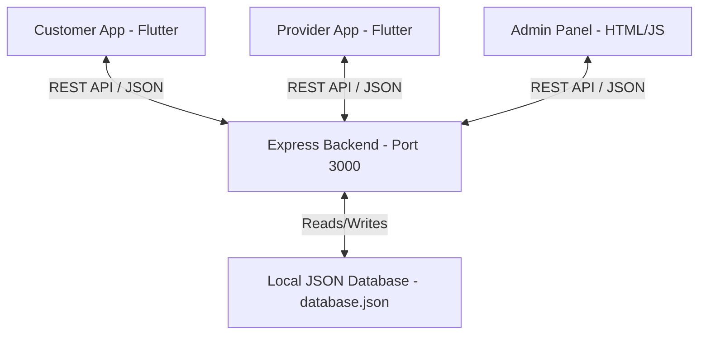

# QuickFix Hyperlocal Service Marketplace 🛠️🚀

Welcome to the **QuickFix** ecosystem! QuickFix is an enterprise-grade hyperlocal service marketplace system. It connects customers seeking home maintenance, cleaning, plumbing, or electrical repairs with nearby professionals and service shops.

The project is structured as a multi-module repository comprising mobile applications, a management dashboard, and a central backend service.

---

## 📂 Project Ecosystem

The workspace is organized into four main directories:

| Directory | Module / Purpose | Technology Stack | Key Features |
| :--- | :--- | :--- | :--- |
| [quickfix/](file:///c:/Users/yadav/OneDrive/Desktop/quickfixx/quickfix) | **Customer App** | Flutter & Riverpod | Location selector, category filters, cart management, checkout with Razorpay, and live GPS map tracking. |
| [quickfix_provider/](file:///c:/Users/yadav/OneDrive/Desktop/quickfixx/quickfix_provider) | **Provider Partner App** | Flutter & Riverpod | Partner onboarding, service pricing editor, online/offline status switch, and incoming jobs stream. |
| [quickfix_backend/](file:///c:/Users/yadav/OneDrive/Desktop/quickfixx/quickfix_backend) | **Central REST Backend** | Node.js & Express | Local database store (`database.json`), shop registration, order dispatch, status updates, and push notifications. |
| [quickfix_admin_web/](file:///c:/Users/yadav/OneDrive/Desktop/quickfixx/quickfix_admin_web) | **Central Admin Web Panel** | HTML5, Vanilla JS, CSS3 | Real-time live bookings stream, register new shops, delete shops, toggle active banners, and broadcast push notifications. |

---

## ⚡ Network Port Mapping

By default, the services communicate using the following local network configuration:

* **Central Backend API**: `http://localhost:3000/api`
* **Android Emulator Host Loopback**: `http://10.0.2.2:3000/api` (automatically configured for Android runs)

---

## 🚀 Running the Project

Follow these steps to run the complete ecosystem locally:

### Step 1: Start the Backend Server
Navigate to the backend directory, install dependencies, and spin up the Express server:
```bash
cd quickfix_backend
npm install
npm start
```
The server will start listening at `http://localhost:3000`.

### Step 2: Open the Admin Web Panel
The admin dashboard is a lightweight static web app. 
1. Navigate to [quickfix_admin_web/](file:///c:/Users/yadav/OneDrive/Desktop/quickfixx/quickfix_admin_web).
2. Double-click or open [index.html](file:///c:/Users/yadav/OneDrive/Desktop/quickfixx/quickfix_admin_web/index.html) in any modern browser.
*(Ensure the backend server is running in the background to load data)*.

### Step 3: Run the Customer App
Navigate to the customer app directory, install libraries, and run the app on an emulator/device:
```bash
cd quickfix
flutter pub get
flutter run
```

### Step 4: Run the Provider Partner App
Navigate to the provider partner app directory, install libraries, and run the app:
```bash
cd quickfix_provider
flutter pub get
flutter run
```

---

## 🛠️ Architecture & System Design



- **Communication Layer**: All three frontend clients interact with the Express backend using standardized REST HTTP methods (`GET`, `POST`, `DELETE`).
- **Data Persistence**: The backend uses a local JSON file (`database.json`) acting as a simple, fast key-value document store.
- **Client Caching**: Flutter mobile applications use `Hive` for secure on-device persistence of authorization tokens, local settings, and search histories.
