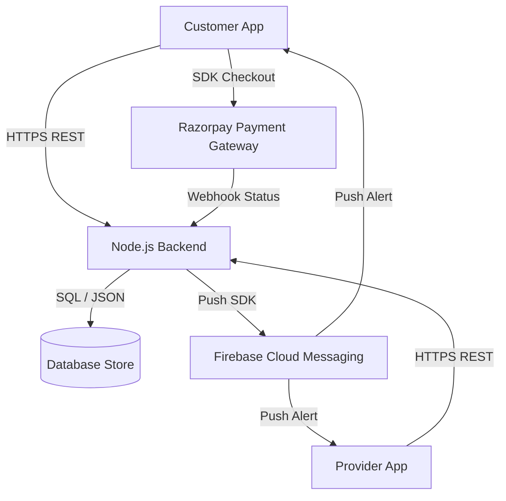
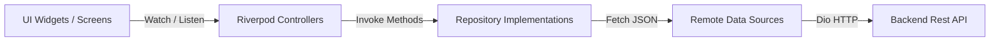

# QuickFix System Architecture

This document describes the high-level architecture of the QuickFix Hyperlocal Service Marketplace ecosystem.

## 1. System Topology

The system consists of the following major components:
- **Customer Mobile App (`quickfix`)**: Flutter application for users to find service providers, place bookings, manage profiles, top up wallets, and track orders.
- **Provider Mobile App (`quickfix_provider`)**: Flutter application for service partners to manage shops, accept/reject booking requests, update service status, and view earnings.
- **Backend Node.js Server (`quickfix_backend`)**: REST API server that manages business logic, geolocation queries, booking statuses, Razorpay webhooks, and routing Firebase notifications.
- **Firebase Ecosystem**: Handles push notification distribution (FCM) and fallback authentication.
- **Database**: Primarily backed by SQLite/PostgreSQL (configured via Supabase/Backend JSON schema) storing users, shops, services, and bookings.

---

## 2. Flutter App Architecture (Clean Architecture & Repository Pattern)

Both mobile applications are structured following a modified Clean Architecture pattern:

### A. Presentation Layer (`lib/features/*/presentation`)
- **Pages / Screens**: Flutter Widgets representing full views (e.g., `HomeScreen`, `LoginScreen`).
- **Widgets**: Reusable, screen-specific components (e.g., `HomeHeader`, `CategoryGrid`).
- **Controllers / Providers**: Riverpod `StateNotifier` or `Notifier` classes managing UI state, loading flags, and error responses.

### B. Domain / Data Layer (`lib/features/*/repositories`)
- **Models**: Plain Dart objects representing data schemas (e.g., `Shop`, `Booking`).
- **Repositories**: Abstract contracts defining the database/network capability.
- **Repository Implementations**: Implementations that retrieve data from data sources (remote APIs or local boxes) and handle mapping/formatting.
- **Data Sources**: Low-level networking classes wrapper around Dio client (`AuthRemoteDataSource`, `HomeRemoteDataSource`).

---

## 3. Key Design Patterns

1. **Dependency Injection via Riverpod**: Dependencies are injected reactively using Riverpod providers. Global singletons like `dioClientProvider` are watched by remote data source providers, which are in turn injected into repository providers.
2. **Repository Pattern**: Ensures presentation code is decoupled from data source engines (e.g., swapping HTTP Client for local mock testing does not impact UI widgets).
3. **Singleton Services**: Storage (`HiveService`) and Push Notifications (`NotificationService`) are written as static utility classes or global singletons to manage persistent connections.
